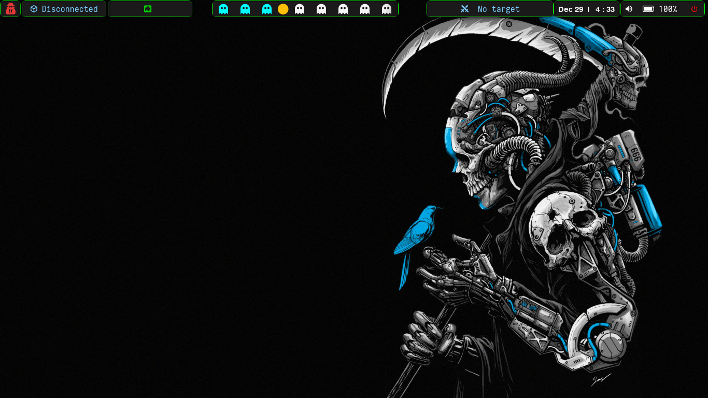
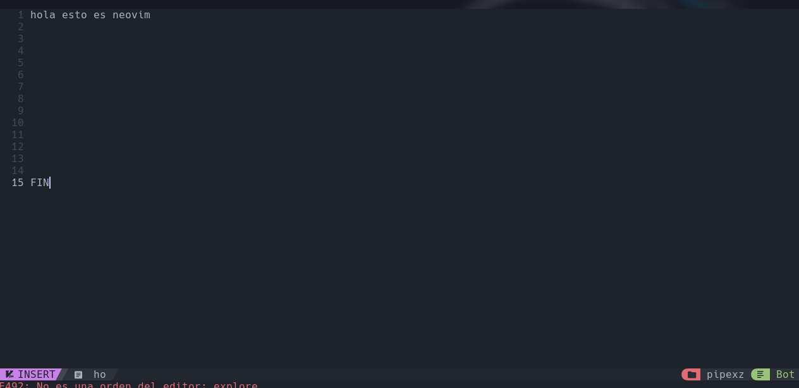
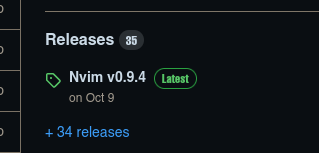
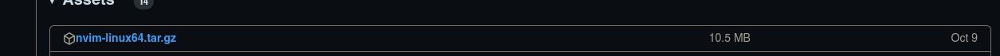
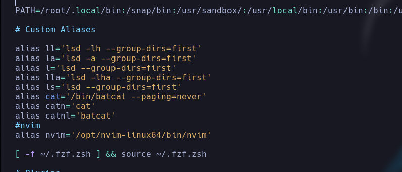

# Bienvenido a mi setup


## Este es mi configuracion basado en uno que tome de otro lugar y lo modifque ami gusto 

* Incluye color diferente y bordes en el area
* le añade el icono de bateria  configurado listo que sirve para su estado  (en caso de que este de forma nativa en un notebook)
* otros recurso 


Para instalar KaliBspwm, sigue estos pasos:
Nos preparamos antes con 

     apt update && apt upgrade -y 
 Clona el repositorio(gracias ZLCube):

    git clone https://github.com/w40m1xz/kalibspwm_by_lucho
    cd KaliBspwm
    chmod +x install.sh
    ./install.sh
 

  - recursos otros
     ```bash
    sudo su apt install flameshot -y

  #3. Descarga las siguientes herramientas:

   - [Obsidian](https://obsidian.md/download)
   - [Visual Studio Code](https://code.visualstudio.com/download)
   - [Brave](https://brave.com/linux/)
   - [Firefox](https://www.mozilla.org/es-CL/firefox/new/)
# para instalar nvim 



primero nos bajamos este repo como root
```bash
    
    git clone https://github.com/NvChad/NvChad.git ~/.config/nvim/ --depth 1
    
   ```
  NOTA: Se debe hacer lo mismo para tenerlo como usuario no privilegiado

 -luego nos vamos a eca https://github.com/neovim/neovim/releases/tag/v0.9.4

 
  
  descargamos esta version
 
 
 
 - una vez configurado  extraemos y movemos la carpeta:
 
    ```bash
    -xf  nvim-linux64.tar.gz 
    mv nvim-linux64 /opt
   ```
- una vez lista nos vamos a nuestra .zshrc y modificamos
   ```bash
    nano /home/tu_usario/.zshrc
   ```
   


- Bajas y agregas esto donde esta alias
   ```bash
    #nvim
   alias nvim='/opt/nvim-linux64/bin/nvim'
   ```

   y LISTO!!


UNA MENCION HONORIFICA A ZLCube, y a s4vitar por su gran Trabajo te dejo el enlace a los perfiles de cada uno de ellos

- ZLCube https://github.com/ZLCube/
-tito S4vitar https://github.com/s4vitar
